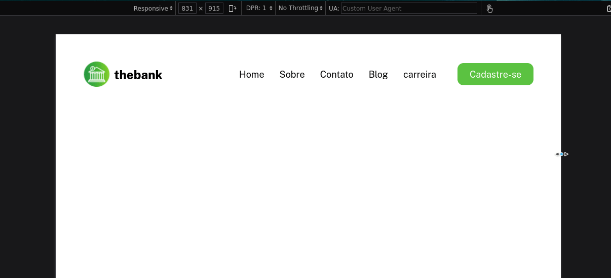

# Flex-box-nav 

  [link do site](https://rafinha-dev.github.io/Flex-box-nav/)
  
 
  
Esse exercício é para praticar o flexbox fazendo um menu, copiando um projeto do figma. 
Essa é minha segunda versão do projeto, o primeiro está no repositório do dev em dobro. 

Um dos conceitos que acabei aprendendo durante o cursso é a organização de forma clara e objetiva. Por isso criei um repositório só para o exercício, armazenando e documentando objetivamente meus conhecimentos.

Para descrição de como foi o processo de construção leia aqui

para ver uma imagem de planejamento clique aqui : [planejamento](./src/asets/planejamento/codando-a-estruturaHTML.png)

## Tecnologias usadas

- [x] html
- [x] css
- [x] flexbox
- [x] figma para copiar o projeto

[figma do projeto](https://www.figma.com/file/DYk9DZr6urB9MZ4iNt1a61/Desafio-HTML-%2B-CSS?node-id=0%3A1)

## contato 

&nbsp;

[contactrodrigues21@gmail.com](mailto:contactrodrigues21@gmail.com) 📫
