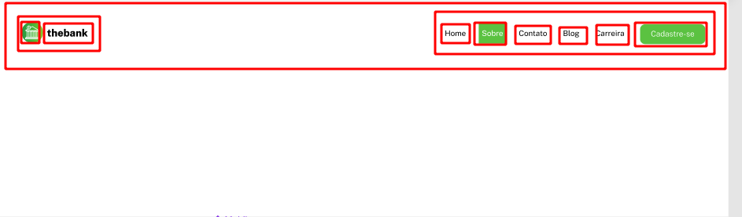
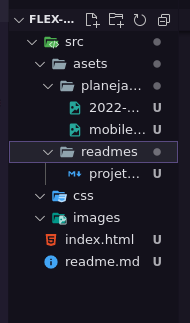

# Etapas do peojeto
    
Aqui um conceito sobre organização de projetos : 

## Etapa 1 

Analizando  o projeto, de forma geral por ser pequeno não irá haver componentização de elementos aqui, as minhas dúvidas foram : 

[x] O quanto seguir a risca os projetos do figma
[x] Misturar o css que aprendi anteriormente com flex-box arrumando os elementos, e assim deixar o código menos "hard code" como eu estava fazendo.
[x] Onde usar propriedades do flex e onde usar propriedades margin padding tradicionais.

[!figma](https://www.figma.com/file/DYk9DZr6urB9MZ4iNt1a61/Desafio-HTML-%2B-CSS?node-id=0%3A1)
Aqui no figma contém o wireframe do projeto.

A principal dúvida que tive ao ver projetos de amigos foi em questão a responsividade e os botões do responsivo na pseudo classe hover. 
Alguns fizeram movimentações dos botões, eu fiz apenas o hover com troca de cor igualmente proposto.
O que digo é que o botão talvez poderia ter ficado melhor! 

## Etapa 2

Criar a estutura base de pastas 

Inicializar o git

## etapa 3 

Criar a estrutura inicial do HTML 
